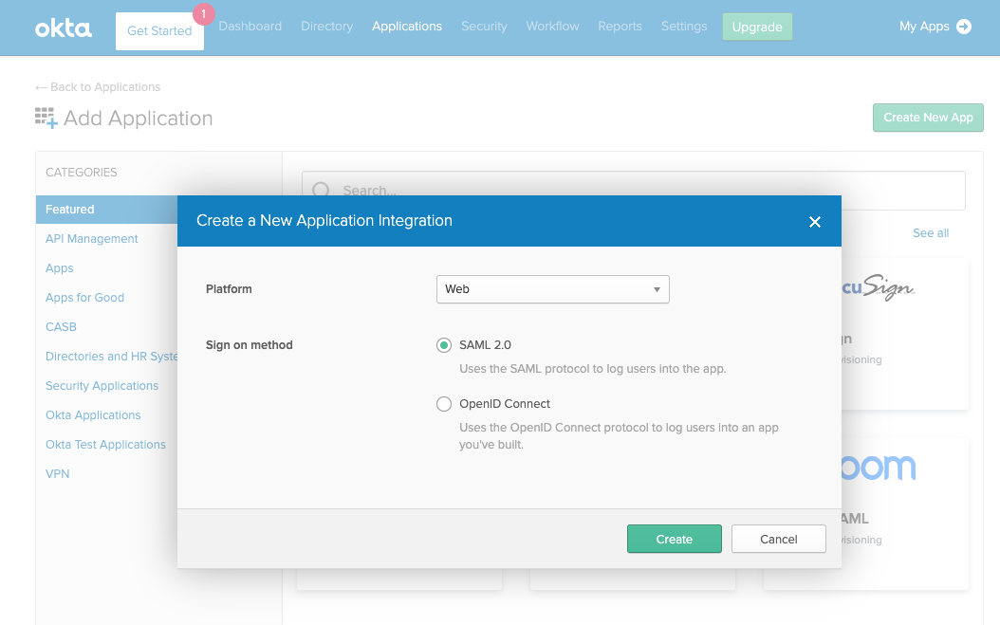
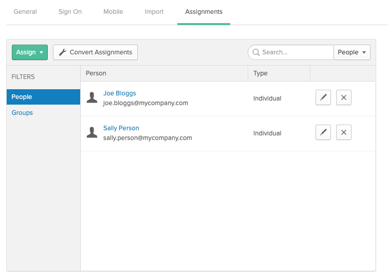
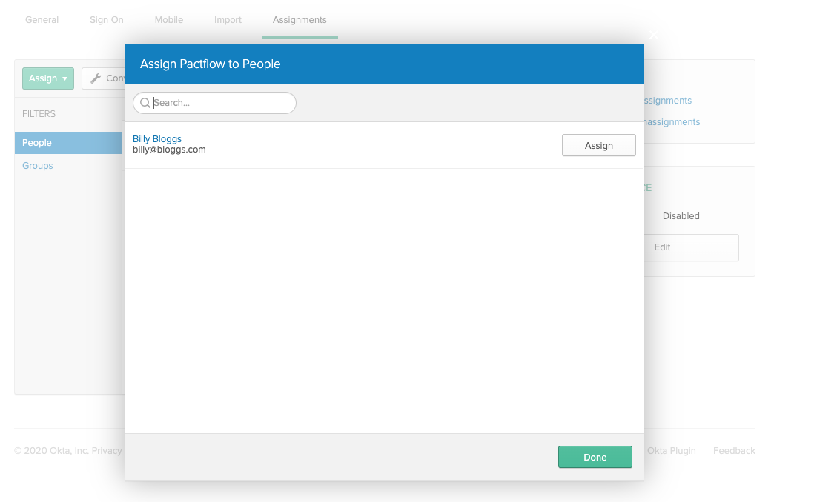
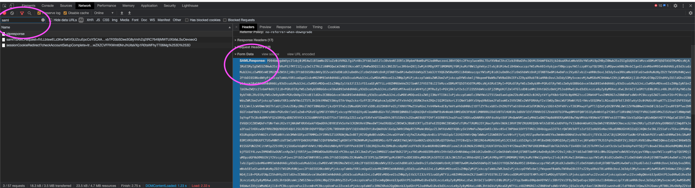

## SAML Support

Business Plans and above include support for a [SAML 2.0](https://en.wikipedia.org/wiki/SAML_2.0) integration with a compatible Identity Provider (IdP) such as Okta, Ping, Auth0, Azure AD, OneLogin etc.

SAML2.0 allows you to externalse the authentication and access to your Pactflow account. Authorization and fine grained permissions are managed within your account by an account Administrator.

Supported capabilities:

* Authorization from an external IdP
* Automated user provisioning into your account
* SP initated login

We do not current support the following:

* Automated user de-provisioning (users will appear "active" and count toward user limits, although will not be able to login if disabled in the IdP)
* IdP initiated login
* Service Provider (SP) initiated logout flow

## Setup

### 1. Configure Pactflow as a Service Provider in your IdP

In your IdP, create a new Service Provider with the following properties:

* Audience URI (SP Entity ID): `urn:amazon:cognito:sp:ap-southeast-2_x0L1olP0D`
* Single sign on URL (Reply URL): `https://pact-saas-prod-1.auth.ap-southeast-2.amazoncognito.com/saml2/idpresponse`
* Name ID format must be set to "Persistent": `urn:oasis:names:tc:SAML:2.0:nameid-format:persistent`

### 2. Map the required SAML2.0 attributes

The following attributes are required by Pactflow and must be mapped in your IdP to be sent through during the authentication flow:

| Property | Name | Name Format |
|----------|------|-------------|
| First name | `http://schemas.xmlsoap.org/ws/2005/05/identity/claims/givenname` | URI Reference |
| Last name | `http://schemas.xmlsoap.org/ws/2005/05/identity/claims/surname` | URI Reference |
| Email Address | `http://schemas.xmlsoap.org/ws/2005/05/identity/claims/emailaddress` | URI Reference |

### 3. Export IdP metadata

Once you have configured Pactflow as a Service Provider, please export your metadata (as XML) or provide an externally accessible URL to us by contacting support at <a href="mailto:support@pactflow.io">support@pactflow.io</a>.

## Examples

The following can be used to compare against your own IdP setup to check if you're missing anything. Note these were both produced via Okta.

### Example valid metadata document

```xml
<?xml version="1.0" encoding="UTF-8"?>
<md:EntityDescriptor xmlns:md="urn:oasis:names:tc:SAML:2.0:metadata" entityID="http://www.okta.com/exkpvtn73rd6mMmF34x6">
   <md:IDPSSODescriptor WantAuthnRequestsSigned="false" protocolSupportEnumeration="urn:oasis:names:tc:SAML:2.0:protocol">
      <md:KeyDescriptor use="signing">
         <ds:KeyInfo xmlns:ds="http://www.w3.org/2000/09/xmldsig#">
            <ds:X509Data>
               <ds:X509Certificate>MIIDpDCCAoygAwIBAgIGAXPl6shZMA0GCSqGSIb3DQEBCwUAMIGSMQswCQYDVQQGEwJVUzETMBEG
A1UECAwKQ2FsaWZvcm5pYTEWMBQGA1UEBwwNU2FuIEZyYW5jaXNjbzENMAsGA1UECgwET2t0YTEU
MBIGA1UECwwLU1NPUHJvdmlkZXIxEzARBgNVBAMMCmRldi04OTA1NTYxHDAaBgkqhkiG9w0BCQEW
DWluZm9Ab2t0YS5jb20wHhcNMjAwODEzMDM0MjU1WhcNMzAwODEzMDM0MzU1WjCBkjELMAkGA1UE
BhMCVVMxEzARBgNVBAgMCkNhbGlmb3JuaWExFjAUBgNVBAcMDVNhbiBGcmFuY2lzY28xDTALBgNV
BAoMBE9rdGExFDASBgNVBAsMC1NTT1Byb3ZpZGVyMRMwEQYDVQQDDApkZXYtODkwNTU2MRwwGgYJ
KoZIhvcNAQkBFg1pbmZvQG9rdGEuY29tMIIBIjANBgkqhkiG9w0BAQEFAAOCAQ8AMIIBCgKCAQEA
mgdKOOa+KPUYuCXNl6ab/1AgaRIzxjvXxyEjAceLig4ljsgRVawo5F8CG2JMa2anejfJdHsu/sNo
SORi59V9MSYso8mH2krRNKkAiMWwXO6ncvHxwWJsZqPnuDMPhU+vhCbxAg9zSKgnuhW/Li/qs16x
IDjmJFUXMSksbC9wEmrHw1hR8Zl94L0lwcTLwVeQtTZ3pfpDN4HT84wA/lc1sn/heXyikv1fgP1E
onpbsQXuFjw9vQT7UekAjeYi0cVTX0wVZ3WKob62v5zJZhFkVrdDbJ7Zsg9sGwXom3RpKcLEw/vo
PcSc69ARiCkHY4fhOSykkFottLh/xsTp0Pw3UQIDAQABMA0GCSqGSIb3DQEBCwUAA4IBAQAEoVfX
8yda3v4s/28nPpy0g+m1oXduagcYKFjCWg7Wou7G47Li8k2Xcm1Ck+gMvDn10dzHq2+RBKwBs59d
msqk2Pq8pI9C5Cp2f7Ad+or3XhpWa4IKQjVvGt1vV2WCasEPHwL+1a9Alhg47x/GmoYoMRHaT7fG
+a3ZYe+QF5cIGFyWj5QxUkKcD/FE37N2DQuPQOzOHDYe9BQCi/FFC2GarpiGIgPQd9RDjsTDpFKC
t9lzfbF/65I6ISDB5TQyCaLvSf8cofivLe3EQpw0sZ97fLi7VOlOY888elByNALcl5rf7qLuh/gP
Oiv9B1SsJ0l/zk0FxwLCCKFGXn1RSV8/</ds:X509Certificate>
            </ds:X509Data>
         </ds:KeyInfo>
      </md:KeyDescriptor>
      <md:NameIDFormat>urn:oasis:names:tc:SAML:1.1:nameid-format:emailAddress</md:NameIDFormat>
      <md:NameIDFormat>urn:oasis:names:tc:SAML:2.0:nameid-format:persistent</md:NameIDFormat>
      <md:SingleSignOnService Binding="urn:oasis:names:tc:SAML:2.0:bindings:HTTP-POST" Location="https://dev-890556.okta.com/app/pactflowdev890556_pactflow_1/exkpvtn73rd6mMmF34x6/sso/saml" />
      <md:SingleSignOnService Binding="urn:oasis:names:tc:SAML:2.0:bindings:HTTP-Redirect" Location="https://dev-890556.okta.com/app/pactflowdev890556_pactflow_1/exkpvtn73rd6mMmF34x6/sso/saml" />
   </md:IDPSSODescriptor>
</md:EntityDescriptor>
```

### Example valid SAML assertion

This is the assertion sent to the Pactflow Reply URL

```xml
<?xml version="1.0" encoding="UTF-8"?>
<saml2p:Response xmlns:saml2p="urn:oasis:names:tc:SAML:2.0:protocol" xmlns:xs="http://www.w3.org/2001/XMLSchema" Destination="https://pact-saas-prod-1.auth.ap-southeast-2.amazoncognito.com/saml2/idpresponse" ID="id3718331499099330736053153" InResponseTo="_125f72fb-e3bf-40d0-ba42-77152c2c0845" IssueInstant="2020-08-19T03:26:29.364Z" Version="2.0">
  <saml2:Issuer xmlns:saml2="urn:oasis:names:tc:SAML:2.0:assertion" Format="urn:oasis:names:tc:SAML:2.0:nameid-format:entity">http://www.okta.com/exkpvtn73rd6mMmF34x6</saml2:Issuer>
  <ds:Signature xmlns:ds="http://www.w3.org/2000/09/xmldsig#">
    <ds:SignedInfo>
      <ds:CanonicalizationMethod Algorithm="http://www.w3.org/2001/10/xml-exc-c14n#" />
      <ds:SignatureMethod Algorithm="http://www.w3.org/2001/04/xmldsig-more#rsa-sha256" />
      <ds:Reference URI="#id3718331499099330736053153">
        <ds:Transforms>
          <ds:Transform Algorithm="http://www.w3.org/2000/09/xmldsig#enveloped-signature" />
          <ds:Transform Algorithm="http://www.w3.org/2001/10/xml-exc-c14n#">
            <ec:InclusiveNamespaces xmlns:ec="http://www.w3.org/2001/10/xml-exc-c14n#" PrefixList="xs" />
          </ds:Transform>
        </ds:Transforms>
        <ds:DigestMethod Algorithm="http://www.w3.org/2001/04/xmlenc#sha256" />
        <ds:DigestValue>uJgujmj ... 26En8=</ds:DigestValue>
      </ds:Reference>
    </ds:SignedInfo>
    <ds:SignatureValue>S/xuVKLEfmIj2I0+Vjvr ... 29vtaSKQkHeQMwCpSUfKIIoZ/OlnDQ==</ds:SignatureValue>
    <ds:KeyInfo>
      <ds:X509Data>
        <ds:X509Certificate>MIIDpDCCAoygAwIBAgIGAXPl6shZMA0GCSqGSIb3DQEBCwUAMIGSMQswCQYDVQQGEwJVUzETMBEG A1UECAwKQ2FsaWZvcm5pYTEWMBQGA1UEBwwNU2FuIEZyYW5jaXNjbzENMAsGA1UECgwET2t0YTEU MBIGA1UECwwLU1NPUHJvdmlkZXIxEzARBgNVBAMMCmRldi04OTA1NTYxHDAaBgkqhkiG9w0BCQEW DWluZm9Ab2t0YS5jb20wHhcNMjAwODEzMDM0MjU1WhcNMzAwODEzMDM0MzU1WjCBkjELMAkGA1UEBhMCVVMxEzARBgNVBAgMCkNhbGlmb3JuaWExFjAUBgNVBAcMDVNhbiBGcmFuY2lzY28xDTALBgNVBAoMBE9rdGExFDASBgNVBAsMC1NTT1Byb3ZpZGVyMRMwEQYDVQQDDApkZXYtODkwNTU2MRwwGgYJ KoZIhvcNAQkBFg1pbmZvQG9rdGEuY29tMIIBIjANBgkqhkiG9w0BAQEFAAOCAQ8AMIIBCgKCAQEAmgdKOOa+KPUYuCXNl6ab/1AgaRIzxjvXxyEjAceLig4ljsgRVawo5F8CG2JMa2anejfJdHsu/sNoSORi59V9MSYso8mH2krRNKkAiMWwXO6ncvHxwWJsZqPnuDMPhU+vhCbxAg9zSKgnuhW/Li/qs16x IDjmJFUXMSksbC9wEmrHw1hR8Zl94L0lwcTLwVeQtTZ3pfpDN4HT84wA/lc1sn/heXyikv1fgP1EonpbsQXuFjw9vQT7UekAjeYi0cVTX0wVZ3WKob62v5zJZhFkVrdDbJ7Zsg9sGwXom3RpKcLEw/voPcSc69ARiCkHY4fhOSykkFottLh/xsTp0Pw3UQIDAQABMA0GCSqGSIb3DQEBCwUAA4IBAQAEoVfX 8yda3v4s/28nPpy0g+m1oXduagcYKFjCWg7Wou7G47Li8k2Xcm1Ck+gMvDn10dzHq2+RBKwBs59dmsqk2Pq8pI9C5Cp2f7Ad+or3XhpWa4IKQjVvGt1vV2WCasEPHwL+1a9Alhg47x/GmoYoMRHaT7fG+a3ZYe+QF5cIGFyWj5QxUkKcD/FE37N2DQuPQOzOHDYe9BQCi/FFC2GarpiGIgPQd9RDjsTDpFKt9lzfbF/65I6ISDB5TQyCaLvSf8cofivLe3EQpw0sZ97fLi7VOlOY888elByNALcl5rf7qLuh/gPOiv9B1SsJ0l/zk0FxwLCCKFGXn1RSV8/</ds:X509Certificate>
      </ds:X509Data>
    </ds:KeyInfo>
  </ds:Signature>
  <saml2p:Status>
    <saml2p:StatusCode Value="urn:oasis:names:tc:SAML:2.0:status:Success" />
  </saml2p:Status>
  <saml2:Assertion xmlns:saml2="urn:oasis:names:tc:SAML:2.0:assertion" ID="id37183314991817892005295917" IssueInstant="2020-08-19T03:26:29.364Z" Version="2.0">
    <saml2:Issuer Format="urn:oasis:names:tc:SAML:2.0:nameid-format:entity">http://www.okta.com/exkpvtn73rd6mMmF34x6</saml2:Issuer>
    <ds:Signature xmlns:ds="http://www.w3.org/2000/09/xmldsig#">
      <ds:SignedInfo>
        <ds:CanonicalizationMethod Algorithm="http://www.w3.org/2001/10/xml-exc-c14n#" />
        <ds:SignatureMethod Algorithm="http://www.w3.org/2001/04/xmldsig-more#rsa-sha256" />
        <ds:Reference URI="#id37183314991817892005295917">
          <ds:Transforms>
            <ds:Transform Algorithm="http://www.w3.org/2000/09/xmldsig#enveloped-signature" />
            <ds:Transform Algorithm="http://www.w3.org/2001/10/xml-exc-c14n#">
              <ec:InclusiveNamespaces xmlns:ec="http://www.w3.org/2001/10/xml-exc-c14n#" PrefixList="xs" />
            </ds:Transform>
          </ds:Transforms>
          <ds:DigestMethod Algorithm="http://www.w3.org/2001/04/xmlenc#sha256" />
          <ds:DigestValue>UTRr45 ... 7drNjg2E=</ds:DigestValue>
        </ds:Reference>
      </ds:SignedInfo>
      <ds:SignatureValue>a7SSAhT+xjgmwq0d+y6 ... 3Wzt+9g3sIeOuz30MuDn+kUjqs1w==</ds:SignatureValue>
      <ds:KeyInfo>
        <ds:X509Data>
          <ds:X509Certificate>MIIDpDCCAoygAwIBAgIGAXPl6shZMA0GCSqGSIb3DQEBCwUAMIGSMQswCQYDVQQGEwJVUzETMBEG A1UECAwKQ2FsaWZvcm5pYTEWMBQGA1UEBwwNU2FuIEZyYW5jaXNjbzENMAsGA1UECgwET2t0YTEU MBIGA1UECwwLU1NPUHJvdmlkZXIxEzARBgNVBAMMCmRldi04OTA1NTYxHDAaBgkqhkiG9w0BCQEW DWluZm9Ab2t0YS5jb20wHhcNMjAwODEzMDM0MjU1WhcNMzAwODEzMDM0MzU1WjCBkjELMAkGA1UEBhMCVVMxEzARBgNVBAgMCkNhbGlmb3JuaWExFjAUBgNVBAcMDVNhbiBGcmFuY2lzY28xDTALBgNVBAoMBE9rdGExFDASBgNVBAsMC1NTT1Byb3ZpZGVyMRMwEQYDVQQDDApkZXYtODkwNTU2MRwwGgYJ KoZIhvcNAQkBFg1pbmZvQG9rdGEuY29tMIIBIjANBgkqhkiG9w0BAQEFAAOCAQ8AMIIBCgKCAQEAmgdKOOa+KPUYuCXNl6ab/1AgaRIzxjvXxyEjAceLig4ljsgRVawo5F8CG2JMa2anejfJdHsu/sNoSORi59V9MSYso8mH2krRNKkAiMWwXO6ncvHxwWJsZqPnuDMPhU+vhCbxAg9zSKgnuhW/Li/qs16x IDjmJFUXMSksbC9wEmrHw1hR8Zl94L0lwcTLwVeQtTZ3pfpDN4HT84wA/lc1sn/heXyikv1fgP1EonpbsQXuFjw9vQT7UekAjeYi0cVTX0wVZ3WKob62v5zJZhFkVrdDbJ7Zsg9sGwXom3RpKcLEw/voPcSc69ARiCkHY4fhOSykkFottLh/xsTp0Pw3UQIDAQABMA0GCSqGSIb3DQEBCwUAA4IBAQAEoVfX8yda3v4s/28nPpy0g+m1oXduagcYKFjCWg7Wou7G47Li8k2Xcm1Ck+gMvDn10dzHq2+RBKwBs59d msqk2Pq8pI9C5Cp2f7Ad+or3XhpWa4IKQjVvGt1vV2WCasEPHwL+1a9Alhg47x/GmoYoMRHaT7fG+a3ZYe+QF5cIGFyWj5QxUkKcD/FE37N2DQuPQOzOHDYe9BQCi/FFC2GarpiGIgPQd9RDjsTDpFKCt9lzfbF/65I6ISDB5TQyCaLvSf8cofivLe3EQpw0sZ97fLi7VOlOY888elByNALcl5rf7qLuh/gPOiv9B1SsJ0l/zk0FxwLCCKFGXn1RSV8/</ds:X509Certificate>
        </ds:X509Data>
      </ds:KeyInfo>
    </ds:Signature>
    <saml2:Subject>
      <saml2:NameID Format="urn:oasis:names:tc:SAML:2.0:nameid-format:persistent">joe@bloggs.com</saml2:NameID>
      <saml2:SubjectConfirmation Method="urn:oasis:names:tc:SAML:2.0:cm:bearer">
        <saml2:SubjectConfirmationData InResponseTo="_125f72fb-e3bf-40d0-ba42-77152c2c0845" NotOnOrAfter="2020-08-19T03:31:29.364Z" Recipient="https://pact-saas-prod-1.auth.ap-southeast-2.amazoncognito.com/saml2/idpresponse" />
      </saml2:SubjectConfirmation>
    </saml2:Subject>
    <saml2:Conditions NotBefore="2020-08-19T03:21:29.364Z" NotOnOrAfter="2020-08-19T03:31:29.364Z">
      <saml2:AudienceRestriction>
        <saml2:Audience>urn:amazon:cognito:sp:ap-southeast-2_x0L1olP0D</saml2:Audience>
      </saml2:AudienceRestriction>
    </saml2:Conditions>
    <saml2:AuthnStatement AuthnInstant="2020-08-19T03:26:29.364Z" SessionIndex="_125f72fb-e3bf-40d0-ba42-77152c2c0845">
      <saml2:AuthnContext>
        <saml2:AuthnContextClassRef>urn:oasis:names:tc:SAML:2.0:ac:classes:PasswordProtectedTransport</saml2:AuthnContextClassRef>
      </saml2:AuthnContext>
    </saml2:AuthnStatement>
    <saml2:AttributeStatement>
      <saml2:Attribute Name="http://schemas.xmlsoap.org/ws/2005/05/identity/claims/givenname" NameFormat="urn:oasis:names:tc:SAML:2.0:attrname-format:uri">
        <saml2:AttributeValue xmlns:xsi="http://www.w3.org/2001/XMLSchema-instance" xsi:type="xs:string">Joe</saml2:AttributeValue>
      </saml2:Attribute>
      <saml2:Attribute Name="http://schemas.xmlsoap.org/ws/2005/05/identity/claims/surname" NameFormat="urn:oasis:names:tc:SAML:2.0:attrname-format:uri">
        <saml2:AttributeValue xmlns:xsi="http://www.w3.org/2001/XMLSchema-instance" xsi:type="xs:string">Bloggs</saml2:AttributeValue>
      </saml2:Attribute>
      <saml2:Attribute Name="http://schemas.xmlsoap.org/ws/2005/05/identity/claims/emailaddress" NameFormat="urn:oasis:names:tc:SAML:2.0:attrname-format:uri">
        <saml2:AttributeValue xmlns:xsi="http://www.w3.org/2001/XMLSchema-instance" xsi:type="xs:string">joe@bloggs.com</saml2:AttributeValue>
      </saml2:Attribute>
    </saml2:AttributeStatement>
  </saml2:Assertion>
</saml2p:Response>
```

## IdP Guides

### Okta

See https://developer.okta.com/docs/guides/build-sso-integration/saml2/overview/ for further details on any of the steps below.

#### 1. Create a SAML app in Okta

1. Open the Okta Developer Console.
1. Choose Applications, and then choose Add Application.
1. On the Add Application page, choose Create New App.
1. In the Create a New Application Integration dialog, confirm that Platform is set to Web.
1. For Sign on method, choose SAML 2.0.
1. Choose Create.



#### 2. Configure SAML integration for your Okta app

1. On the Create SAML Integration page, under General Settings, enter a name for your app.
1. (Optional) Upload a logo and choose the visibility settings for your app.
1. Choose Next.
1. Under GENERAL, for Single sign on URL, enter `https://pact-saas-prod-1.auth.ap-southeast-2.amazoncognito.com/saml2/idpresponse`.
1. For Audience URI (SP Entity ID), enter urn: `urn:amazon:cognito:sp:ap-southeast-2_x0L1olP0D`
1. Under ATTRIBUTE STATEMENTS (OPTIONAL), add 3 statements with the following information:
    1. For Name, enter the SAML attribute name `http://schemas.xmlsoap.org/ws/2005/05/identity/claims/givenname`.
    1. For Value, enter `user.firstName`.
    1. For Name, enter the SAML attribute name `http://schemas.xmlsoap.org/ws/2005/05/identity/claims/surname`.
    1. For Value, enter `user.lastName`.
    1. For Name, enter the SAML attribute name `http://schemas.xmlsoap.org/ws/2005/05/identity/claims/emailaddress`.
    1. For Value, enter `user.email`.
1. Choose Next.
1. Choose a feedback response for Okta Support.
1. Choose Finish.


#### 3. Assign a user to your Okta application

1. On the Assignments tab for your Okta app, for Assign, choose Assign to People.
1. Next to the user that you want to assign, choose Assign.
1. Note: If this is a new account, the only option available is to choose yourself (the admin) as the user.
1. Choose Save and Go Back. Your user is assigned.
1. Choose Done.




#### 4. Get the IdP metadata for your Okta application

1. On the Sign On tab for your Okta app, find the Identity Provider metadata hyperlink. Right-click the hyperlink, and then copy the URL.
1. For more information, see Configure SAML in your app in the Set up a SAML application in Okta guide on the Okta Developer website.

#### 5. Contact Pactflow to enable your IdP

Send your unique metadata URL to us by contacting support at <a href="mailto:support@pactflow.io">support@pactflow.io</a>.

### Azure Active Directory

1. Create a non gallery application
1. Follow the [Microsoft documentation](https://docs.microsoft.com/en-us/azure/active-directory/manage-apps/add-non-gallery-app) for creating a non gallery application.
  * Choose `Non-gallery application` at the `Add your own app` screen.
  * Set the name to `Pactflow On-Premesis` when prompted.
1. When the application has been created, assign the users that should be allowed to login to Pactflow.
1. Once the users have been assigned, select the `Single sign-on` tab. Select `SAML`.
1. Set the Identifier (Entity ID) to `urn:amazon:cognito:sp:ap-southeast-2_x0L1olP0D`
1. Set the Reply URL to `https://pact-saas-prod-1.auth.ap-southeast-2.amazoncognito.com/saml2/idpresponse`
1. Leave the Sign On URL, Relay State and Logout Url fields blank.
1. Map the following attributes:
    1. First Name: `http://schemas.xmlsoap.org/ws/2005/05/identity/claims/givenname`.
    1. Last Name: `http://schemas.xmlsoap.org/ws/2005/05/identity/claims/surname`.
    1. Email Address: `http://schemas.xmlsoap.org/ws/2005/05/identity/claims/emailaddress`.


## Debugging

### Debug SAML Assertions

The SAML login assertion request/response happens via the browser, and for security reasons, it's not something Pactflow is able to see.

You can however, extract the SAML assertion from your web browser during a login flow. For example, using most modern browsers such as Chrome perform the following steps:

1. Open your developer tools console
1. View the network tab and ensure "persist" or "preserve log" is enabled
1. Head to your pactflow account: `https://<youraccount>.pactflow.io`
1. Login via your IdP until you experience the issue
1. Find the request to `https://pact-saas-prod-1.auth.ap-southeast-2.amazoncognito.com/saml2/idpresponse`
1. Copy the value of the `SAMLResponse` into a tool such as https://www.samltool.com/ to decode and view



## Troubleshooting

### 1. Name not appearing in user management screens

You are missing the mappings for "First name" and "Last Name", see `Map the required SAML2.0 attributes` in Setup.

### 2. "Invalid State/RelayState provided"

Your SAML provider has not been configured on the Pactflow side (please contact us if this is the case) or the metadata document supplied does not match your IdP.

### 3. "Invalid samlResponse or relayState from identity provider"

You have attempted to login via your IdP (IdP Initiated Login) which is not supported.