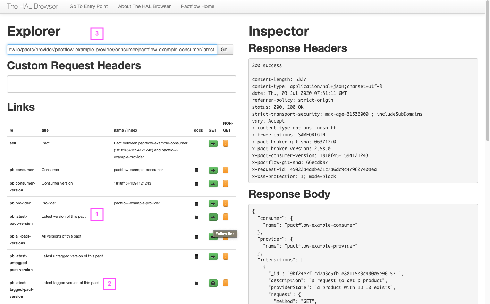

## Stub APIs

Every contract published to Pactflow is automatically assigned a hosted API stub URL that you can use for stubbing API backends in your testing.

Hosted API stubs are useful for a number of use cases, such as:

1. Replacing end-to-end test environments when running UI testing tools like Cypress or mobile UI tests
1. Using as a dynamic test environment for new feature testing
1. Local development with multiple back-ends
1. Sharing with other teams so they can experiment safely with your API

## Basic Use

To use the stub:

1. You must first have published a contract
1. Find the path to the pact contract you'd like to stub.  (if you're not familiar with the Pactflow API, the simplest way to get this is to click "View Pact" from the dashboard and select the "API Browser" at the top of the screen to see the URL)
1. Append `/stub/` to the path of the pact file to get the base path of an instant stub

## Stub URL format

Pacts may be retrieved in several ways; the latest version, the latest with a particular tag, or the latest for a consumer version.

Stub URLs will have one of the following formats:

| Description | URL |
| ----------- | --- |
| Latest for integration | `/pacts/provider/:provider/consumer/:consumer/latest/stub` |
| Latest for a given tag | `/pacts/provider/:provider/consumer/:consumer/latest/:tag/stub` |
| Latest for a consumer version | `/pacts/provider/:provider/consumer/:consumer/:version/stub` |

For example, assuming you wanted to use the latest version of a particular contract as your stub, the base URL to configure in your client code would be:

```sh
https://<yourdomain>.pactflow.io/pacts/provider/:provider/consumer/:consumer/latest/stub
```

## Stub behaviour

Pact contracts may define multiple overlapping requests - for example when there are provider states.

Where multiple matching interactions are found, the interactions will be sorted by response status, and the first one will be returned. This may lead to some non-deterministic behaviour.

_NOTE: currently only versions 1 and 2 of the [pact specification](https://github.com/pact-foundation/pact-specification/) are currently fully supported. Pacts using the v3 format may be used, however, any matching features added in v3 will currently be ignored._

## Example

_The following example uses the example projects in our [CI/CD workshop](https://docs.pactflow.io/docs/workshops/ci-cd/)_

Let's say you have a [Product API](https://github.com/pactflow/example-provider) `example-provider` that you would like to stub when working with a [React consumer](https://github.com/pactflow/example-consnumer) `example-consumer`.

There are two main endpoitns:

* `GET /products`: Retrieve all products:
* `GET /products/:id`: Retrieve a single product

The (simplified) pact file for this integration looks something like this:

```json
{
  "consumer": {
    "name": "example-consumer"
  },
  "provider": {
    "name": "example-provider"
  },
  "interactions": [
    {
      "description": "a request to get a product",
      "providerState": "a product with ID 10 exists",
      "request": {
        "method": "GET",
        "path": "/product/10",
        "headers": {
          "Authorization": "Bearer 2019-01-14T11:34:18.045Z"
        }
      },
      "response": {
        "status": 200,
        "headers": {
          "Content-Type": "application/json; charset=utf-8"
        },
        "body": {
          "id": "10",
          "type": "CREDIT_CARD",
          "name": "28 Degrees"
        }
      }
    },
    {
      "description": "a request to get all products",
      "providerState": "products exists",
      "request": {
        "method": "GET",
        "path": "/products",
        "headers": {
          "Authorization": "Bearer 2019-01-14T11:34:18.045Z"
        }
      },
      "response": {
        "status": 200,
        "headers": {
          "Content-Type": "application/json; charset=utf-8"
        },
        "body": [
          {
            "id": "10",
            "type": "CREDIT_CARD",
            "name": "28 Degrees"
          }
        ]
      }
    }
  ],
  "metadata": {
    "pactSpecification": {
      "version": "2.0.0"
    }
  }
}
```

You want to use the latest pact file for the purposes of the stub, which is hosted on `test.pactflow.io`. In the example app, you can set the base URL of all API calls with the environment variable `REACT_APP_API_BASE_URL`.

```sh
export REACT_APP_API_BASE_URL=https://test.pactflow.io/pacts/provider/pactflow-example-provider/consumer/pactflow-example-consumer/latest/stub
npm start
```

That's it - if you open up the application in your browser you can navigate around, using the live stub service.


## CORS

By default, [CORS](https://developer.mozilla.org/en-US/docs/Web/HTTP/CORS) requests are enabled on all stub APIs. The CORS configuration is as follows:

| CORS header | Configuration | Description |
| ----------- | ------------- | ----------- |
| `Access-Control-Allow-Origin` | Reflects the `Origin` send in the HTTP pre-flight request | All origins are allowed |
| `Access-Control-Allow-Headers` | `*` | All headers are allowed |
| `Access-Control-Allow-Methods` | `*` | All methods are allowed |
| `Access-Control-Allow-Credentials` | `true` | Credentials may be sent in CORS requests |


## Finding the URL to a pact resource

### Via the User Interface

You can copy the stub URL template from the pact dashboard or pact drill-down view via the `⫶` drop-down:


This is the simplest method, and is easily customised as per the URL format described above.

### Via the API

Sometimes you have the need to find the exact version. To do this, you can navigate the API user the HAL browser (and also directly via the API on the command line).

### 1. Find the integration

Navigate to the dashboard and find the integration you're interested in.


### 2. Open the API Browser

Open the API Browser by selecting "API" in the header toolbar.


### 3. Find the pact

From here, you will be at the latest version for the integration. You can navigate from here to the specific version of an integration to get the URL you need:

1. Select the `->` to navigate to the latest version
1. Select the `->` to navigate to the latest tagged version of the pact
1. Copy the URL in this address to get the path to the pact file. By default, it will link to the version of the pact you were on in step 2

