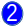
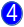

## Main Screen

The main Pactflow screen has four functional areas.

&nbsp;

&nbsp;

 
The list of all interactions are displayed on the left panel. An interaction here is the pair of a consumer and provider that have a pact. Select an interaction to have its details displayed in the center panel. The status icon (see table below) will be displayed for the verification result of latest pact.

 
The details of the selected interaction will be displayed here.

 
You can filter the list of interactions here by either the Consumer or Provider name.

The tabs at the top provide different views of the currently selected interaction. The Network
Diagram will display a graph view of all the interactions that are reachable from the selected one.
The Matrix will display more details of all the pacts and verifications of the selected interaction.

 
The settings (or cog) button will take you to all the setting screens. Here you'll be able to setup
tokens and web-hooks.

&nbsp;

| Status Icon | Description |
|-------------|-------------|
|  | The pact has a successful verification published for it. |
|  | The latest verification for the pact had failed. |
|  | No verification result has been published for the pact. |
|  | A new version of the pact has been published since the last verification result was received. |
