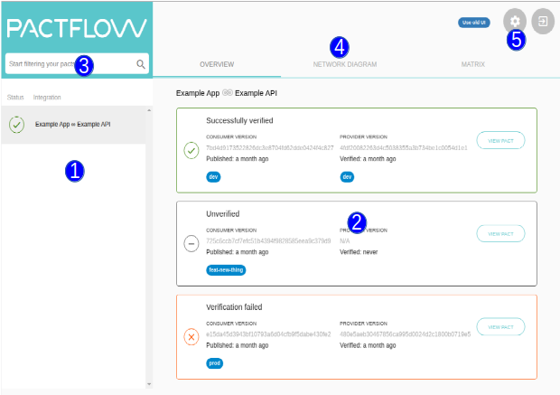

## Main Screen

The main Pactflow screen has four functional areas.

&nbsp;

&nbsp;

The list of all integrations are displayed on the left panel. An integration here is the pair of a consumer and provider that have a pact. Select an integration to have its details displayed in the center panel. The status icon (see table below) will be displayed for the verification result of latest pact.

The details of the selected integration will be displayed here.

You can filter the list of integrations here by either the Consumer or Provider name.

The tabs at the top provide different views of the currently selected integration. The Network
Diagram will display a graph view of all the integrations that are reachable from the selected one.
The Matrix will display more details of all the pacts and verifications of the selected integration.

The settings (or cog) button will take you to all the setting screens. Here you'll be able to setup
[API tokens](#settings-api-tokens) and [webhooks](#settings-webhooks).

&nbsp;

| Status | Description |
|-------------|-------------|
|  | The pact has a successful verification published for it. |
|  | The latest verification for the pact had failed. |
|  | No verification result has been published for the pact. |
|  | A new version of the pact has been published since the last verification result was received. |

## Settings

### Settings - Webhooks

Here you will be able to create and edit your webhooks.

| Field | Description |
| ----- | ----------- |
| Description | A description of your webhook |
| Consumer | You can select a specific consumer for the webhook, or `ALL` for all consumers.  |
| Provider | You can select a specific provider for the webhook, or `ALL` for all providers. |
| Events | Select the events for which you want the webhook to fire (Mandatory to select one). |
| Method | All webhook requests will be of type HTTP Post. |
| URL | The URL to send the webhook request to (Mandatory). You can use dynamic variables in this field. |
| Headers | Headers as `KEY: VALUE` pairs to set on the request. |
| Body | The body of the request. You can use dynamic variables in the body. |
| Basic auth username | The username to use if your webhook requires Basic HTTP authentication |
| Basic auth password | The password to use if your webhook requires Basic HTTP authentication |
| Enabled | Uncheck this if you wish to disable the webhook |

#### Webhook event types

##### Contract published with changed content or tags

If your pact is published _without_ any tags applied to the consumer version, then this event will be fired if the pact content is different from the previous version.

If your pact is published _with_ tags applied to the consumer version, then you can think of all the pacts that share the same tag name as forming a time ordered "pseudo branch". This event will fire if the new pact for any of the "pseudo branches" is different from the previous version. One of the implications of this is that if a pact is published with the same content as a previous version, but with a new tag, this event will fire as it is considered to be the first version of a new pseudo branch.

If you want a provider build to be triggered by pact changes, then select this event for your webhook.

##### Contract published

This event fires every time a pact is published.

##### Provider verification published

This event fires every time a provider verification is published.

#### Dynamic Variables

The following variables may be used in the path of the URL, the query parameters and body, and will be replaced with their appropriate values at runtime.

| Expression | Description |
| ---------- | ----------- |
| ${pactbroker.consumerName} | The consumer name |
| ${pactbroker.providerName} | The provider name |
| ${pactbroker.pactUrl} | The URL to the newly published or most recently verified pact |
| ${pactbroker.verificationResultUrl} | The URL to the relevant verification result |
| ${pactbroker.githubVerificationStatus} | The verification status using the correct keywords for posting to the the Github commit status API |
| ${pactbroker.consumerVersionNumber} | The version number of the most recent consumer version associated with the pact content |
| ${pactbroker.providerVersionNumber} | The provider version number for the verification result |
| ${pactbroker.consumerVersionTags} | The list of tag names for the most recent consumer version associated with the pact content, separated by ", " |
| ${pactbroker.providerVersionTags} | The list of tag names for the provider version associated with the verification result, separated by ", " |
| ${pactbroker.consumerLabels} | The list of labels for the consumer associated with the pact content, separated by ", " |
| ${pactbroker.providerLabels} | The list of labels for the provider associated with the pact content, separated by ", " |

### Settings - Secrets

&nbsp;

&nbsp;

You can create your own variables to store sensitive values like usernames and passwords here. These will be encrypted and then stored in the Pactflow platform and available to use when editing your webhooks.

&nbsp;

&nbsp;

| Field | Description |
| ---------- | ----------- |
| Name | Give a name to your secret. This will be available as a dynamic variable prefixed with `user.`. For instance, if you create a `JenkinsUser` secret you can access it as `${user.JenkinsUser}`. |
| Description | Describe what your secret is here. |
| Value | The value you need encrypted. |

### Settings - API Tokens

Here you can copy and re-generate your API tokens. There are two tokens you can use, a read only token
for anything that needs to download pacts, and a read-write token for anything required to publish
pact files or verification results. The read/write token should only be used by your CI when publishing pacts and verification results, and the read only token should be used for a developer's machine.

The *Copy* button allows you to copy the token values without displaying them, and the *Regenerate* button will allow you to generate a new value for that token.

