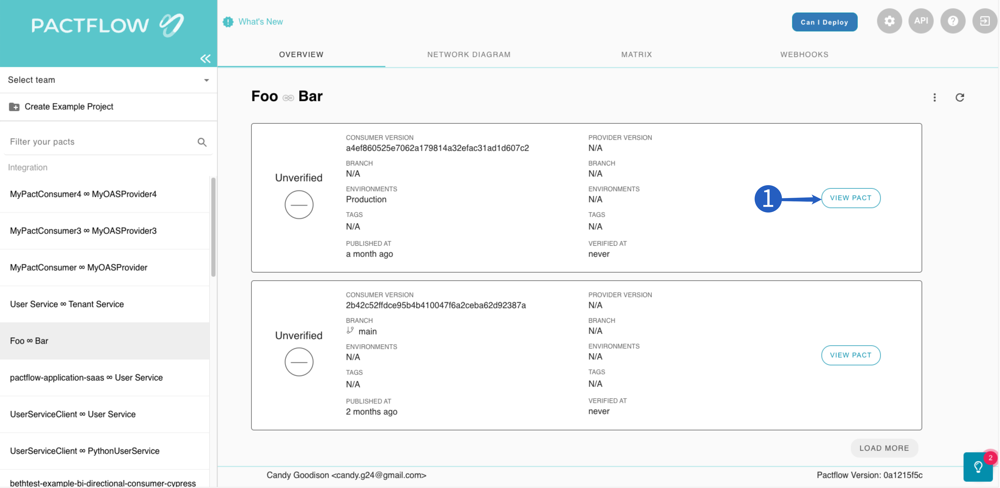
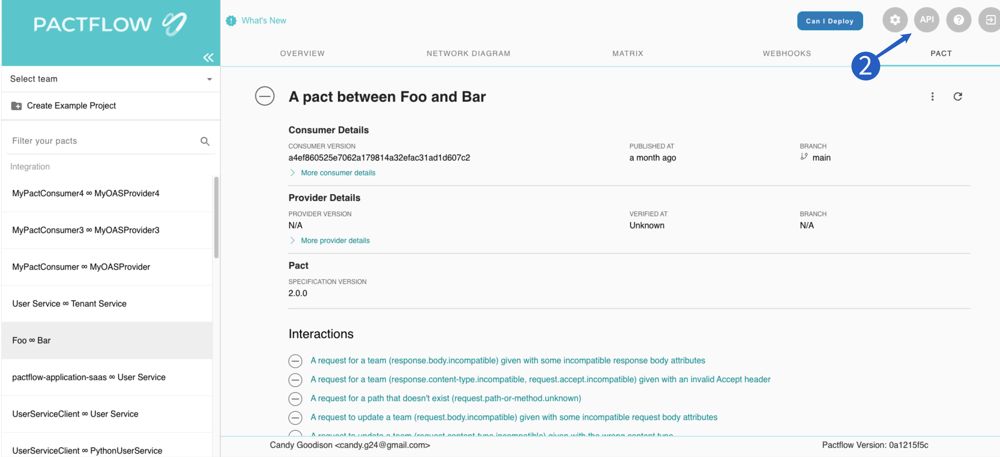
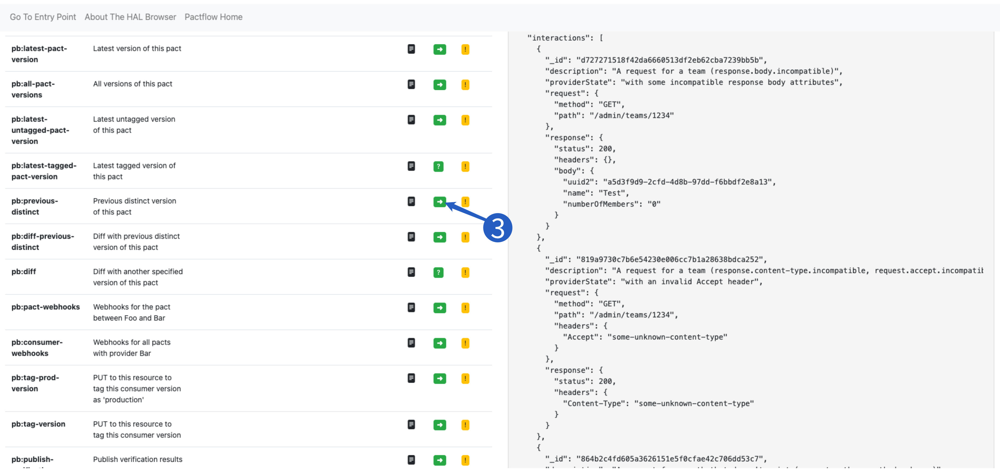
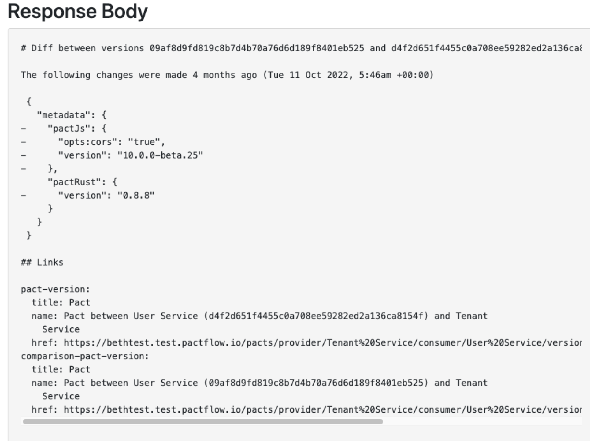
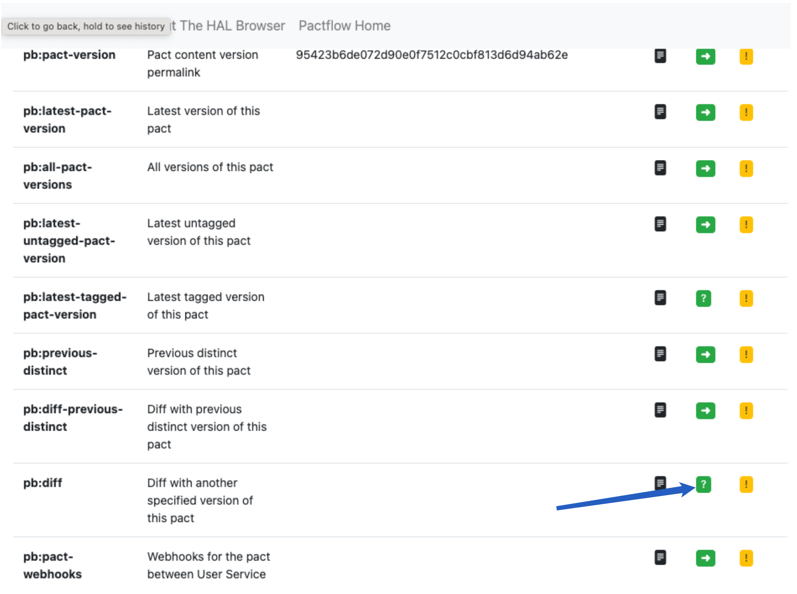
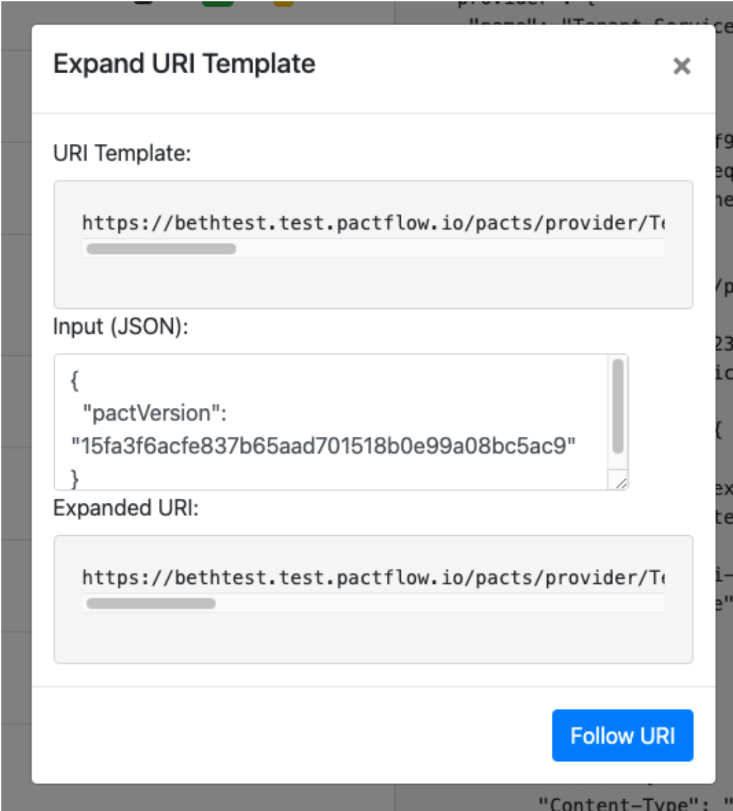

## Get a pact URL

The same pact can be referenced by URL in multiple ways. Therefore, there are multiple ways to get the URL for a pact in the UI.

### By consumer version

When a pact is published, the URL specifies the provider's name, the consumer's name and the consumer version. This same URL can be used to retrive pact. To copy this URL into the clipboard, click the `VIEW PACT` button from the Overview page, click the vertical `...` icon to the right of the Pact's title and select `Copy pact URL for {consumer} version {version}` item.

### By tag

Locate the latest pact with the desired tag in the Overview page, click the blue or grey pill icon that represents the application version tag, and select `Copy pact URL`. This menu can also be accessed from the Pact detail page.

### Latest overall

To get the URL of the latest pact for a consumer/provider, on the Overview page, click the vertical `...` icon, and select `Copy latest pact URL`.

## Delete a single pact

Locate the pact to be deleted in the Overview page. Click `VIEW PACT`. Click the vertical `...` icon to the right of the Pact's title and select `Delete pact for {consumer} version {version}`.

## Delete all pacts with a given tag

Locate the latest pact with the desired tag in the Overview page, click the blue or grey pill icon that represents the application version tag, and select `Delete all pacts with tag {tag}`. This item will only be visible if the user has the [contract_data:bulk_delete](/docs/permissions#contract_databulk_delete) permission for this integration.

## Delete all pacts for a consumer/provider

On the Overview page, click the vertical `...` icon in the top right of the Overview pane. Select `Delete all pacts`. This will delete all versions of the pact. It will keep the consumer and provider, and all other data related to them (webhooks, application versions, branches, and tags).

## Delete all pacts and associated objects for a consumer/provider

On the Overview page, click the vertical `...` icon in the top right of the Overview pane. Select `Delete integration`. This will delete all data associated with this integration (applications, pacts, verifications, application versions, branches, tags and webhooks) that are not associated with other integrations.

## Delete verification results

Locate the pact with the verification results that you want to delete in the Overview page and click `VIEW PACT`. Click the vertical `...` icon to the right of the Pact's title and select `Delete verification results for {provider} version {version}.` If you cannot see the delete option, it is because you do not have the required permission for the provider application. Note that the verification results belong to the pact _content_. Other pact publications may share the same content, so deleting the verification results may affect the verification status of other pacts.

## View the verification results for a specific consumer/provider version

Select the `Matrix` tag for the desired integration. Locate the row with the desired consumer/provider version combination and click the link in the `Pact published` column.

## Remove a tag from an application version

This feature is not currently supported directly through the UI, however, it can be achieved through the API browser. Note that the tag belongs to the _application version_, not directly to the pact. So, removing a tag from an application version also removes it from any other pacts associated with that application version.

- Locate a pact with the desired tag in the Overview page.
- Click the blue or grey pill icon and select `Copy tag URL`.
- Click the `API` button in the top right of the screen.
- Paste the tag URL into the location bar in the `Explorer` section and click `Go`.
- In the `Links` section, click the yellow `!` icon under the `NON-GET` column.
- Change the `Method` to `DELETE`, and click `Make Request`.

## See what has changed in a pact

To see the most recent change to a pact (for example, to determine why provider verification failed):

1. Locate the failed integration in the PactFlow overview. Click the `VIEW PACT` button to the right of the failed verification to view the Pact.

2. Click the `API` button at the top right of the screen to open the API browser (aka HAL Browser)

3. On the API Browser page search for pb:diff-previous-distinct and click the Follow Link (green icon)

4. You will see a resource describing the last changes made to the pact.

## See what has changed between two arbitrary pacts

1. Get the SHA of the first Pact you want to compare:
   - View the most recently published version of the pact you want to compare
   - Click the `API` button in the top right of the screen to open the API browser (aka HAL Browser)
   - Search for the `pb:pact-version` row. Copy the SHA from the name/index column. This is the SHA for the published pact file

2. Repeat for the pact you want to use as a base for the comparison, but this time search the `for pb:diff` row

3. Click the Query URI Template (green question mark)

4. In the pop up paste the first SHA you copied as the value for the "pactVersion" param. Click Follow URI to see the result.

