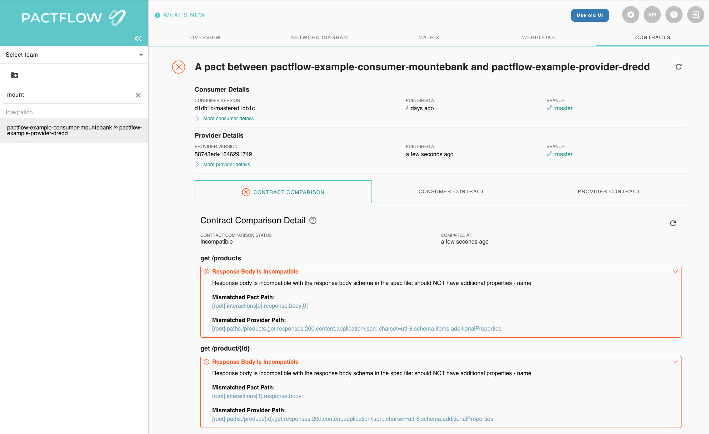

# When things go bad

So far everything has been really easy. Let's go a bit deeper and introduce a breaking change into the system. Breaking changes come in two main ways:

1. A consumer can add a new expectation (e.g. a new field/endpoint) on a provider that doesn't exist
1. A provider might make a change (e.g. remove or rename a field) that breaks an existing consumer

Pactflow will detect such situations using the `can-i-deploy` tool. When it runs, it performs a contract comparison that checks if the consumer contract is a valid subset of the provider contract in the target environment.

Let's see it in action.

## Provider breaking changes

Change directories into `cd /root/example-bi-directional-provider-dredd`{{execute interrupt}}

1.  Try changing the provider code in a backwards incompatible way, what happens?

        ```
        // First comment out the 'price' key in the product.js file and from the OAS, then run
        npm t
        npm run publish
        npm run can-i-deploy
        ```

OK, that was a trick! Note how in the consumer's `Product` definition, it doesn't actually use the `price` field? Pactflow knows all of the consumers needs down to the field level. Because no consumer uses `price` this is a safe operation.

Revert the change `git checkout --`{{execute}}

2.  Try changing the provider code in a way that will break it's existing consumer. For example, comment out all references to `name` in the OAS and run the steps from above:

```
✗ npm run can-i-deploy

> product-service@1.0.0 can-i-deploy /Users/matthewfellows/development/public/pactflow-example-bi-directional-provider-dredd
> pact-broker can-i-deploy --pacticipant pactflow-example-bi-directional-provider-dredd --version="$(npx @pact-foundation/absolute-version)" --to-environment production

npx: installed 47 in 1.509s
Computer says no ¯_(ツ)_/¯

CONSUMER                             | C.VERSION          | PROVIDER                        | P.VERSION                                | SUCCESS? | RESULT#
-------------------------------------|--------------------|---------------------------------|------------------------------------------|----------|--------
pactflow-example-consumer-mountebank | 5009e94+1645930887 | pactflow-example-bi-directional-provider-dredd | aec911-master+aec911.SNAPSHOT.Matts-iMac | false    | 1

VERIFICATION RESULTS
--------------------
1. https://testdemo.pactflow.io/hal-browser/browser.html#https://testdemo.pactflow.io/contracts/provider/pactflow-example-bi-directional-provider-dredd/version/aec911-master%2Baec911.SNAPSHOT.Matts-iMac/consumer/pactflow-example-consumer-mountebank/pact-version/908c12f39ad2e9d9b31ff82a367f6e68368344b3/verification-results (failure)

The cross contract verification between the pact for the version of pactflow-example-consumer-mountebank currently deployed to production (5009e94+1645930887) and the oas for version aec911-master+aec911.SNAPSHOT.Matts-iMac of pactflow-example-bi-directional-provider-dredd failed
```

If you head into the Pactflow UI and drill down into the "contract comparison" tab, you'll see the output from comparing the consumer and provider contracts:



As you can see, it's alerting us to the fact that the consumer needs a field `name` but the provider doesn't support it.

Read more about how to [interpret failures](https://docs.pactflow.io/docs/bi-directional-contract-testing/compatibility-checks).

## Consumer breaking changes

Change directories into your consumer project: `cd /root/example-bi-directional-consumer-mountebank`{{execute}}

1.  Try adding a new expectation on the provider by updating the contract. For example, add a new property to the `expectedProduct` field in `example-bi-directional-consumer-mountebank/src/api.spec.js`{{open}}:

        ```
        npm t
        npm run publish
        npm run can-i-deploy
        ```
        You shouldn't be able to deploy!

```
✗ npm run can-i-deploy

> consumer@0.1.0 can-i-deploy /Users/matthewfellows/development/public/pactflow-example-consumer-mountebank
> pact-broker can-i-deploy --pacticipant pactflow-example-consumer-mountebank --version="$(npx @pact-foundation/absolute-version)" --to-environment production

npx: installed 47 in 2.64s
Computer says no ¯_(ツ)_/¯

CONSUMER                             | C.VERSION                                | PROVIDER                        | P.VERSION          | SUCCESS? | RESULT#
-------------------------------------|------------------------------------------|---------------------------------|--------------------|----------|--------
pactflow-example-consumer-mountebank | 009e94-master+009e94.SNAPSHOT.Matts-iMac | pactflow-example-bi-directional-provider-dredd | caec911+1645930967 | false    | 1

VERIFICATION RESULTS
--------------------
1. https://testdemo.pactflow.io/hal-browser/browser.html#https://testdemo.pactflow.io/contracts/provider/pactflow-example-bi-directional-provider-dredd/version/caec911%2B1645930967/consumer/pactflow-example-consumer-mountebank/pact-version/a34e535ec10e8c1fd04202ae4b9d3943b780c332/verification-results (failure)

The cross contract verification between the pact for version 009e94-master+009e94.SNAPSHOT.Matts-iMac of pactflow-example-consumer-mountebank and the oas for the version of pactflow-example-bi-directional-provider-dredd currently deployed to production (caec911+1645930967) failed
```

As per the previous failure, you can see it's alerting us to the fact that the consumer needs a field `colour` but the provider doesn't support it.

The consumer won't be able to release this change until the Provider API supports it.

## Check your understanding

1. It is always safe to remove a field from a provider, if no consumers are currently using it
1. It is not safe to remove a field/endpoint from a provider, if an existing consumer _is_ using it, and Pactflow will detect this situation.
1. Pactflow will prevent a consumer from deploying a change that a Provider has yet to support

## Further material

You may be interested in one of our longer form [workshops](https://docs.pact.io/implementation_guides/workshops), or getting deeper into [CI/CD](https://docs.pactflow.io/docs/workshops/ci-cd/) with Pact.
