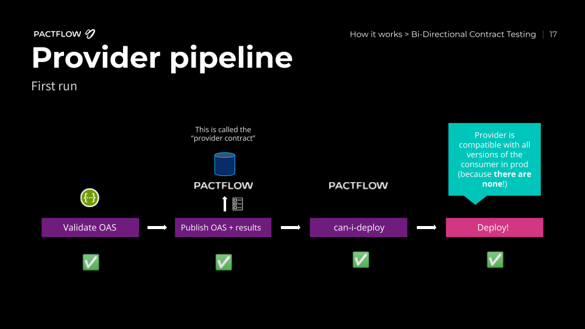

# 5. Deploy the provider to production

:::info
If you are running in github actions, we will do the publish and deploy step all in one here, as we are running our example from the master/main branch
:::

Now that we have tested our provider and published our provider contract, we can deploy the application to production.

Whilst we don't currently have any consumers to worry about, we want to be prepared for when we do. Pactflow has a tool called [`can-i-deploy`](https://docs.pact.io/pact_broker/can_i_deploy) to help us.

The `can-i-deploy` command is an important part of a CI/CD workflow, adding stage gates to prevent deploying incompatible applications to environments such as production.

This diagram shows an illustrative CI/CD pipeline as it relates to our progress to date:



## Deploy the provider to production via your local machine

Let's run the command:

`npm run can-i-deploy`

This should pass, because as we discussed above, there are no consumers:

```
$ npm run can-i-deploy

> product-service@1.0.0 can-i-deploy /root/example-bi-directional-provider-dredd
> pact-broker can-i-deploy --pacticipant pactflow-example-bi-directional-provider-dredd --version="$(npx @pact-foundation/absolute-version)" --to-environment production

npx: installed 47 in 2.835s
Computer says yes \o/

There are no missing dependencies
```

Later on, when consumers start to use our API, we will be prevented from releasing a change that results in a backwards incompatible change for our consumers. Consumers will also use this command to ensure they are compatible with the Provider API in the target environment (in this case, `production`).

We can now deploy our provider to production. Once we have deployed, we let Pactflow know that the new version of the Provider has been promoted to that environment:

`npm run deploy`

This allows Pactflow to communicate to any future consumers of the provider, that the OAS associated with this version of the provider is supported in production. If a consumer adds functionality that uses a subset of the OAS, they will be free to deploy safely!

#### Expected state by the end of this step

- The provider build is passing and it is deployed to production ✅
  
## Deploy the provider to production via Github Actions

### Setup deployment environment

:::info
This step should only be required if you have a legacy Pactflow account. New users should automatically have a production account created
:::

<details>
  <summary>Create a new production environment to record deployments against</summary>

  1. Log in to your Pactflow account (`https://<your-subdomain>.pactflow.io`), and go to Settings > Environments.
  2. Click Add Environment
  3. Enter `production` for the name and display name
  4. Check the "this is a production environment" checkbox
  5. Select the default team
  6. Click "Create"

</details>

### Configure provider pipeline

1. Create a Github Secret to store your Pactflow API token in.
   1. In Pactflow:
      1. Log in to your Pactflow account (`https://<your-subdomain>.pactflow.io`), and go to Settings > API Tokens.
      1. Click the Copy button for the read/write CI token (make sure it's the read _write_ one, not the read only one).
   1. In Github:
      1. Open your forked `example-bi-directional-provider` project (`https://github.com/<your-username>/example-bi-directional-provider`)
      1. Click on the `Settings` tab.
      1. Select `Secrets` from the side menu.
      1. Click `New repository secret` (the button is to the right of the "Actions secrets" heading)
      1. Set the name of the secret to `PACTFLOW_TOKEN_FOR_CI_CD_WORKSHOP`
      1. Paste in the Pactflow API token value you copied in the previous step.
2. Update your workflow files in GitHub to point at your Pactflow Broker
   1. In Pactflow:
       1. Go to Settings > API Tokens.
       2. Click the `COPY PACTFLOW BASE URL` button
   2. In Github:
       1. Open your forked `example-bi-directional-provider` project (`https://github.com/<your-username>/example-bi-directional-provider`)
          1. Open `.github/workflows/build.yml`
          2. In the upper right corner of the file view, click 🖊️ to open the file editor.
          3. Update the value of `PACT_BROKER_BASE_URL` to the base URL of your own Pactflow account. You can easily get this by clicking the COPY PACTFLOW BASE URL button on the API Tokens page in Pactflow.
          4. Press the green `Commit changes` button
3. View the build:
   1. In Github:
      1. Select the most recent build, this will have been triggered when you committed the changes in the last page

:::info

This build should now successfully publish the provider contract and evidence, and it will pass on the `can-i-deploy` step before it tries to deploy. This is because the provider has no consumers, so is safe to deploy.

After you have pushed your changes to the workflow files, the provider pipeline will run, fetching and verifying the configured pacts from your Pactflow account, and publishing the results back. The `can-i-deploy` command will pass, and allow the provider to be deployed. ✅
:::

#### Expected state by the end of this step

- The provider build is passing and it is deployed to production ✅

# Check

Your dashboard should now be updated, noting the provider has now been deployed to `production`.
