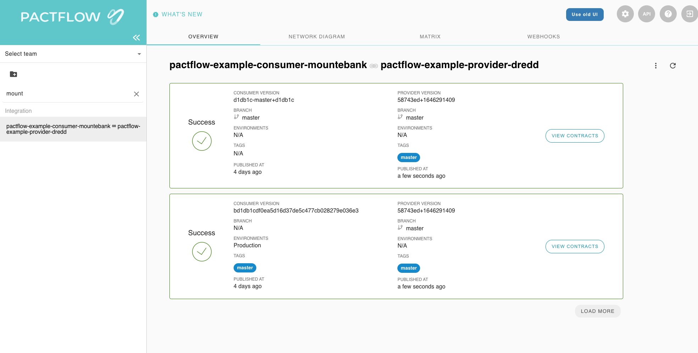

# Deploy your consumer to Production

Now that we have tested our consumer and published our consumer contract, we can deploy the application to production.

Just like our provider counterpart, we're going to call `can-i-deploy` to check if it's safe before we do.

_REMEMBER: The `can-i-deploy` command is an important part of a CI/CD workflow, adding stage gates to prevent deploying incompatible applications to environments such as production_

<!-- This diagram shows an illustrative CI/CD pipeline as it relates to our progress to date:

 -->

Let's run the command:

`npm run can-i-deploy`{{execute}}

This should pass, because the provider has already pulbished its contract and deployed to production, and we believe the consumer is compatible with the provider OAS:

```
$ npx pact-broker can-i-deploy --pacticipant pactflow-example-consumer-mountebank --version $GIT_COMMIT --to-environment production
Computer says yes \o/

CONSUMER                             | C.VERSION | PROVIDER                        | P.VERSION | SUCCESS? | RESULT#
-------------------------------------|-----------|---------------------------------|-----------|----------|--------
pactflow-example-consumer-mountebank | 5009e94   | pactflow-example-bi-directional-provider-dredd | 6559541   | true     | 1

VERIFICATION RESULTS
--------------------
1. https://test.pactflow.io/hal-browser/browser.html#https://test.pactflow.io/contracts/provider/pactflow-example-bi-directional-provider-dredd/version/6559541/consumer/pactflow-example-consumer-mountebank/pact-version/ce2a9dfed28309e26288b9c9333529c92762d36a/verification-results (success)

All required verification results are published and successful
```

We can now deploy our consumer to production. Once we have deployed, we let Pactflow know that the new version of the consumer has been promoted to that environment:

`npm run deploy`{{execute}}

This allows Pactflow to prevent any providers from deploying an incompatible change to `production`.

# Check

Your dashboard should look something like this, where both your consumer and consumer are marked as having been deployed to `production`:


