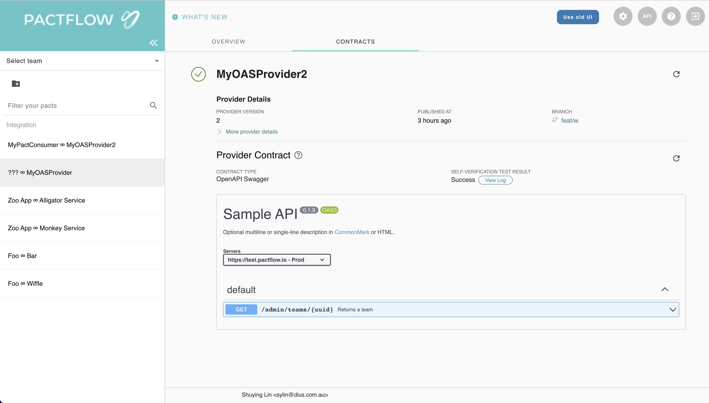
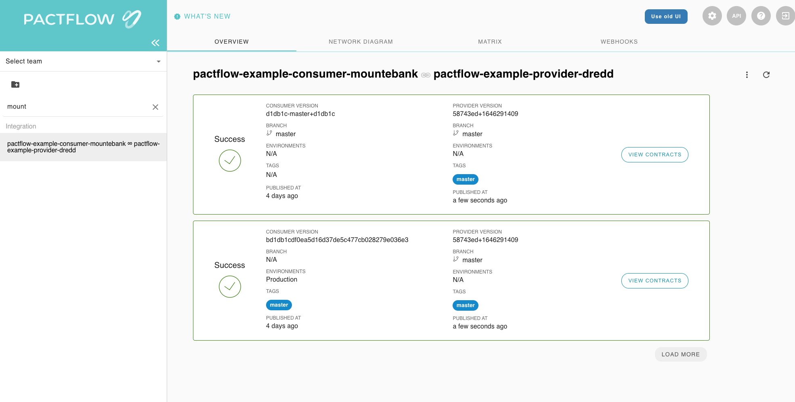
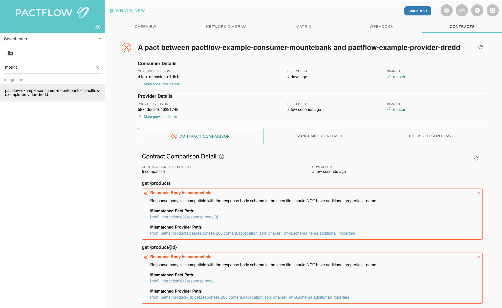

# Quick Start Guide with Github Actions

import ApiSchema from "@theme/ApiSchema";
import { generateTestingToolsTab } from "../../../../src/components/tabGenerator";
import { meta } from "../../../../src/data/meta";

:::success Welcome to the Quick Start Guide
If you want to get hands-on and learn about Bi-Directional Contract testing, and see it come to life, then you are in the right place.
:::

:::note Bring your own devices
You can get started via your phone or tablet, but it's easier at a computer, with just a web browser!
:::

:::info Guides

These testing guides will help provide describe each step in more detail and should serve as a handy reference point

[Provider Testing Guide](/docs/bi-directional-contract-testing/provider)

[Consumer Testing Guide](/docs/bi-directional-contract-testing/consumer) 
:::

## Agenda

You will get to see a full development workflow in actions, it will follow the scenario below, we will simplify it for demonstration by using GitHub to fork the example repositories
and GitHub actions to run the CI pipelines

1. Create and document an API using OpenAPI Specification
1. Write tests for the API using an API testing tool such as RestAssured,Dredd,Postman and Schemathesis/Swashbuckle
1. Publish the provider contract (an OpenAPI document) to Pactflow
1. Deploy the provider to production
1. Write the API consumer
1. Write tests for an API client using tools such as Mountebank,Nock,Wiremock,Nock,Cypress and Mock-Service-Worker or traditional Pact .NET to mock the API, and convert those mocks into a consumer contract
1. Publish the consumer contract to Pactflow
1. Deploy the consumer to production
1. Learn about Pactflow's breaking change detection system

## Table of Contents

- [Get a GitHub account](#get-a-github-account)
- [Get a Pactflow account](#get-a-pactflow-account)
- [Setting the scene](#setting-the-scene)
  - [The Provider](#the-provider)
    - [Design & Implement the API](#design--implement-the-api)
    - [Test & Verify your API](#test--verify-your-api)
    - [Publish your provider contracts](#publish-your-provider-contracts)
    - [Deploy your provider safely to production](#deploy-your-provider-safely-to-production)
- [Pick a provider](#pick-a-provider)
- [Fork the repo](#fork-the-repo)
- [Create a Github Secret to store your Pactflow API token in.](#create-a-github-secret-to-store-your-pactflow-api-token-in)
- [Update your Pactflow Broker Base Url](#update-your-pactflow-broker-base-url)
- [Run the build workflow](#run-the-build-workflow)
- [Setting the scene for our Consumer](#setting-the-scene-for-our-consumer)
  - [The consumer](#the-consumer)
    - [Design & Implementing our API consumer](#design--implementing-our-api-consumer)
    - [Testing and verify the API consumer](#testing-and-verify-the-api-consumer)
    - [Publish your consumer contract to Pactflow](#publish-your-consumer-contract-to-pactflow)
    - [Deploy your consumer safely to production](#deploy-your-consumer-safely-to-production)
- [Run steps again for your consumer](#run-steps-again-for-your-consumer)
- [See a breaking change on either the consumer or the provider](#see-a-breaking-change-on-either-the-consumer-or-the-provider)

## Get a GitHub account

:::info
All our examples run on Github Actions CI pipelines. You'll need an account. Don't worry its free
:::

- [ ] Don't have one - sign up 👉 [here](https://github.com/signup)
- [x] I've already got one!

:::success
You are logged in to your GitHub account
:::

## Get a Pactflow account

:::info
The Bi-Directional Feature is only supported by Pactflow, so you'll need an account, Don't worry, the developer tier is free.
:::

- [ ] Don't have one - sign up 👉 [here](https://pactflow.io/try-for-free)
- [ ] I've got a company account (see below)
- [x] I've already got one!

<details>
  <summary>Using a shared company Pactflow account?</summary>

:::info
You can use a shared company Pactflow account, but it will make things a bit fiddly, as you'll need to change the identifiers of the various resources that get created so that they don't clash with those from other workshop participants. We've found from past experience running workshops that it's much simpler if everyone has their own account.
:::

</details>

:::success
You have got your Pactflow account, and are successfully logged in.
:::

:::warning Where is my email?
Not got an email? Don't forget to check your spam folder, otherwise reach out to the team at hello@pactflow.io
:::

## Setting the scene

:::info
You don't need to read these to get started and run the examples, but they will help provide context once you've finished, so either read them now, or come back to it after.
:::

### The Provider

#### Design & Implement the API

<details>
  <summary>Create and document an API using OpenAPI</summary>

As we are following a specification or [design first approach](https://swagger.io/blog/api-design/design-first-or-code-first-api-development/) to API development, we start by creating an [OpenAPI](https://oai.github.io/Documentation/start-here.html) description document, that describes how our API should work.

Authoring an OAS document is beyond the scope of this tutorial, but you can find plenty of resources on the internet (such as at [swagger.io](https://swagger.io)).

Our products reference openAPI spec is [here](/oas/products)

Inside it, we have 3 main endpoints:

1. `POST /products` - create a new product
1. `GET /products` - gets all products
1. `GET /products/:id` - gets a single product

The product schema is as follows

<ApiSchema id="oas-product" pointer="#/components/schemas/Product" />

Having designed our API, we can now set about building it.

##### Implement the Product API

Here is the Product API using the [Express JS](https://expressjs.com) framework. Once again, writing an API is beyond the scope of this tutorial.

We define our product, the available routes, the datastore (an simple in-memory database) and the server.

```js reference
https://github.com/pactflow/example-bi-directional-provider-dredd/blob/master/src/product/product.js#L1-L8
```

```js reference
https://github.com/pactflow/example-bi-directional-provider-dredd/blob/master/src/product/product.routes.js#L1-L8
```

```js reference
https://github.com/pactflow/example-bi-directional-provider-dredd/blob/master/src/product/product.repository.js#L1-L26
```

```js reference
https://github.com/pactflow/example-bi-directional-provider-dredd/blob/master/src/product/product.controller.js#L1-L19
```

```js reference
https://github.com/pactflow/example-bi-directional-provider-dredd/blob/master/server.js#L1-L16
```

</details>

#### Test & Verify your API

<details>
  <summary>Writing tests for your provider</summary>
Now that we have our working Provider, we need to do two things to prevent introducing breaking changes to our consumers.

1. Ensure the API doesn't drift from it's OpenAPI description document (OAS)
2. Ensure the OAS doesn't change such that it could break any of its consumers

Right now, we don't have any consumers, but we want to be prepared for when we do.

For (1), we need to decide on our testing approach.
For (2), we'll use Pactflow's contract comparison capability to prevent breaking changes, which we cover in Step 5.

##### Verifying the provider contract

There are severals ways we can test the Provider, to ensure it doesn't drift from the OAS. This process is referred to as _verifying the provider contract_.

1. Generate the OAS from code. This is the most reliable, because whenever the implementation changes, the OAS will change with it. Tools like Spring Docs (Java) and Swashbuckle (.NET) will do this for you.
1. White-box style tests that run as part of your unit tests. Tools such as RestAssured (Java) or Supertest (NodeJS) are examples.
1. Black-box style functional API testing, using tools like Dredd or Postman.

In our case, (1) is not acceptable as we've chosen to following design first approach. We decided to use (3), using a tool called Dredd. Dredd will read in our OAS, and issue HTTP calls to our locally running provider to ensure it's compatible with the spec.

##### Run the Provider tests

When using a black-box style tool, the testing involves the following steps:

1. Starting the API locally, stubbing out downstream dependencies where possible
1. Preparing data so that all of the OAS scenarios may be tested
1. Configuring the tool to read in the OAS and discover the provider
1. Running the tool
1. Capturing the output

Here is the Dredd configuration file, with some properties removed for clarity:

`example-bi-directional-provider-dredd/dredd.yml`

```
...
language: nodejs
server: npm start
server-wait: 3
reporter: [markdown]
output: [./output/report.md]
loglevel: warning
config: ./dredd.yml
blueprint: ./oas/products.yml
endpoint: 'http://127.0.0.1:3001'
```

Dredd will start our provider (`npm start`), read in the OAS file (`./oas/products.yml`) and then issue requests and assert on responses to our locally running provider at `http://127.0.0.1:3001`.

</details>

#### Publish your provider contracts


<details>
  <summary>Publish the provider contract to Pactflow</summary>


:::success Find out more
See our Publishing contracts [docs](http://localhost:3000/docs/bi-directional-contract-testing/publishing) for more info
:::

Now that we have created and verified our provider contract, we need to share the contract to our consumers. This is where Pactflow comes in to the picture. This step is referred to as "publishing" the provider contract.

The publishing step takes two key components:

- The provider contract itself (in our case, the OAS document)
- The test results (in our case, the Dredd output and whether or not it passed)

This information will be helpful later on, when we need to check compatibility with its consumers.

After you run through the process your dashboard will look this this



</details>

#### Deploy your provider safely to production

<details>
  <summary>Deploy the provider to production</summary>

Now that we have tested our provider and published our provider contract, we can deploy the application to production.

Whilst we don't currently have any consumers to worry about, we want to be prepared for when we do. Pactflow has a tool called [`can-i-deploy`](https://docs.pact.io/pact_broker/can_i_deploy) to help us.

The `can-i-deploy` command is an important part of a CI/CD workflow, adding stage gates to prevent deploying incompatible applications to environments such as production.

This diagram shows an illustrative CI/CD pipeline as it relates to our progress to date:


##### Deploy the provider to production

Let's run the command:

`npm run can-i-deploy`

This should pass, because as we discussed above, there are no consumers:

```
$ npm run can-i-deploy

> product-service@1.0.0 can-i-deploy /root/example-bi-directional-provider-dredd
> pact-broker can-i-deploy --pacticipant pactflow-example-bi-directional-provider-dredd --version="$(npx @pact-foundation/absolute-version)" --to-environment production

npx: installed 47 in 2.835s
Computer says yes \o/

There are no missing dependencies
```

Later on, when consumers start to use our API, we will be prevented from releasing a change that results in a backwards incompatible change for our consumers. Consumers will also use this command to ensure they are compatible with the Provider API in the target environment (in this case, `production`).

We can now deploy our provider to production. Once we have deployed, we let Pactflow know that the new version of the Provider has been promoted to that environment:

`npm run deploy`

This allows Pactflow to communicate to any future consumers of the provider, that the OAS associated with this version of the provider is supported in production. If a consumer adds functionality that uses a subset of the OAS, they will be free to deploy safely!

##### Expected state by the end of this step

- The provider build is passing and it is deployed to production ✅

</details>

## Pick a provider

:::info
You can pick your provider now, compatibility is shown in the project readme's or in our [examples page](/docs/examples#demos)
:::

<div>
  {generateTestingToolsTab({
    data: meta.testing_tools_provider_side,
    withLabel: true,
    withLink: true,
  })}
</div>

## Fork the repo

1. Fork the selected project in to your own Github account (click the 'Fork' button in the top right).

:::success
In the GitHub address bar you can see `https://github.com/<your_github_id>/example-bi-directional-provider-<your_chosen_provider>` ✅
:::

## Create a Github Secret to store your Pactflow API token in.

1.  In Pactflow:
    1. Log in to your Pactflow account (`https://<your-subdomain>.pactflow.io`), and go to Settings > API Tokens - See [here](/#configuring-your-api-token) for the docs.
    1. Click the Copy button for the read/write CI token (make sure it's the read _write_ one, not the read only one).
1.  In Github:
    1. Open your forked `example-bi-directional-provider` project (`https://github.com/<your-username>/example-bi-directional-provider`)
    1. Click on the `Settings` tab.
    1. Select `Secrets` from the side menu.
    1. Click `New repository secret` (the button is to the right of the "Actions secrets" heading)
    1. Set the name of the secret to `PACTFLOW_TOKEN_FOR_CI_CD_WORKSHOP`
    1. Paste in the Pactflow API token value you copied in the previous step.

:::success
You've successfully updated your PACTFLOW_TOKEN_FOR_CI_CD_WORKSHOP to your read/write CI token from Pactflow ✅
:::

## Update your Pactflow Broker Base Url

:::info
We are going to edit our GitHub actions built-in file editor. If you need more info on how to, check their docs [here](https://docs.github.com/en/repositories/working-with-files/managing-files/editing-files) 
:::

1.  In Pactflow:
    1. Go to Settings > API Tokens.
    1. Click the `COPY PACTFLOW BASE URL` button
1.  In Github:
    1. Open your forked `example-bi-directional-provider` project (`https://github.com/<your-username>/example-bi-directional-provider`)
       1. Open `.github/workflows/build.yml`
       2. In the upper right corner of the file view, click 🖊️ to open the file editor.
       3. Update the value of `PACT_BROKER_BASE_URL` to the base URL of your own Pactflow account. You can easily get this by clicking the COPY PACTFLOW BASE URL button on the API Tokens page in Pactflow.
       4. Press the green `Commit changes` button

:::success
You've successfully updated your PACT_BROKER_BASE_URL to be the same as shown in your web browser address bar, when you view your Pactflow account ✅
:::

## Run the build workflow

**In Github:**

1.  In Github:
    1. Open your forked `example-bi-directional-provider-<tool>` project (`https://github.com/<your-username>/example-bi-directional-provider-<tool>`)
    2. Click on the `Actions` tab.
    3. Click the button with the text "I understand my workflows, go ahead and enable them"
    4. Under the `Workflows` menu on the left, select `Build`.
    5. You will see the text `This workflow has a workflow_dispatch event trigger`. To the right of that text is a button with the label `Run workflow`. Click the button.
    6. Leave the branch as `master` and click the green `Run workflow` button.

This diagram shows an illustrative CI/CD pipeline as it relates to our progress to date:


Your dashboard should look something like this:


:::success
This build should now successfully publish the provider contract and evidence, and it will pass on the `can-i-deploy` step before it tries to deploy. This is because the provider has no consumers, so is safe to deploy.

After you have pushed your changes to the workflow files, the provider pipeline will run, fetching and verifying the configured pacts from your Pactflow account, and publishing the results back. The `can-i-deploy` command will pass, and allow the provider to be deployed. ✅
:::

## Setting the scene for our Consumer

### The Consumer

#### Design & Implementing our API consumer

<details>
  <summary>Writing the API consumer</summary>

Time to create our consumer code base. For the sake of simplicity, we're going to focus only on the bits of our application that communicate to the provider. In our project, they are:

- The model (the `Product` class), representing the data returned from the Product API: `example-bi-directional-consumer-mountebank/src/api.js`
- The API client (the `ProductApiClient`) which will be responsible for making the HTTP calls to the Product API and returning an internal representation of an Product: `example-bi-directional-consumer-mountebank/src/product.js`

Install the dependencies for the project: `npm i`

##### Product Model

```js reference
https://github.com/pactflow/example-bi-directional-consumer-mountebank/blob/master/src/product.js#L1-L10
```

##### Product API Client

Here is a version of our API client code. This code is responsible for fetching products from the API, and returning a `Product`:

```js reference
https://github.com/pactflow/example-bi-directional-consumer-mountebank/blob/master/src/api.js#L1-L36
```

This class, and specifically the `getProduct()` and `getAllProducts` methods, will be the target of our contract tests.

</details>

#### Testing and verify the API consumer

<details>
  <summary>Write consumer tests</summary>

Now that we have written our consumer code, we need to test it, and ensure that it is compatible with its provider.

##### Scope of a consumer contract test

Ideally, contract tests should be closer to a _unit test_ for your API client class, and they should just focus on ensuring that the request creation and response handling are correct. Running in the context of a unit testing framework (Jest, JUnit, PHPUnit etc.) will give you the most flexible and reliable tests - even if the test is not strictly a unit test by definition.

_NOTE: In Bi-Directional Contract Testing however, you don't need to worry as much if these tests overlap into functional or other forms of tests like you would with Pact. This means they may be higher level - including initiated via a UI test (see this [Cypress example](https://github.com/pactflow/example-bi-directional-consumer-cypress))._

Usually, your application will be broken down into a number of sub-components, depending on what type of application your consumer is \(e.g. a Web application or another API\). This is how you might visualise the focus of a consumer contract test:


Here, a _Collaborator_ is a component whose job is to communicate with another system. In our case, this is the `API` class communicating with the external `Product API` system. This is what we want our consumer test to inspect.

##### Choosing a contract testing strategy

Pactflow currently supports pact files as a consumer contract format. In order to produce a consumer contract, you need to decide on a testing approach to capture the contract:

1. Use [Pact](https://docs.pact.io) - this will be the default choice for many, as it can both mock the API calls and produce a pact file
2. Use an existing mocking tools such as Wiremock or Mountebank, or record/replay tools (such as VCR or Polly), and convert the mocks to a pact file after a successful run.

[Read more](https://docs.pactflow.io/docs/bi-directional-contract-testing/contracts/pact#strategies-to-capture-consumer-contracts) on these strategies.

As there are plenty of [example projects](https://docs.pactflow.io/docs/examples) for how to write Pact tests, _we will choose option (2)_ and use [Mountebank](http://mbtest.org/) to mock our APIs so you have a model to follow for your specific mocking tool.

##### The contract test

Let's dive in! First, let's open up the API spec and go through the key bits: `example-bi-directional-consumer-mountebank/src/api.spec.js`

The following key libraries and tools are used:

1. Mountebank - for stubbing API behaviour
2. Jest - for running our unit tests and providing assertions

##### Setup

At the start of our test, we configure a few important lifecycle hooks:

```javascript
const mb = new Mountebank(); // (1)
const api = new ProductAPIClient(`http://localhost:${imposterPort}`); // (2)
const imposter = new Imposter() // (3)
  .withPort(imposterPort)
  .withRecordRequests(true);

beforeAll(() => startAndClearStubs()); // (4)
afterEach(() => writeStubs(mb, imposterPort)); // (5)
afterAll(() => stopStubs()); // (6)
```

1. First, we use a [neat little library](https://github.com/AngelaE/ts-mountebank) that wraps the Mountebank API for us, enabling us to configure Mountebank mocks in code.
1. We create a new `ProductAPIClient`, directing it to send API calls to the Mountebank mock server, instead of the real one
1. We create a new Imposter (Mountebank's term for creating a mock) that we'll use to mock out various API calls

We then have a few lifecycle methods:

4. Before any tests run, we must start the Mountebank mock server
5. After each test, we will use a little utility to inspect what mocks were called, and write them to a pact file
6. At the end of all tests, we shut down the Mountebank process

##### Test

Now that we have the infrastructure in place, we can simply write our tests.

```javascript
describe("retrieving products", () => {
  test("products exists", async () => {
    // (1) Arrange
    imposter.withStub(
      new Stub()
        .withPredicate(
          new EqualPredicate().withMethod(HttpMethod.GET).withPath("/products")
        )
        .withResponse(
          new Response().withStatusCode(200).withJSONBody([expectedProduct])
        )
    );
    await mb.createImposter(imposter);

    // (2) Act
    const products = await api.getAllProducts();

    // (3) Assert that we got the expected response
    expect(products).toStrictEqual([new Product(expectedProduct)]);
  });
});
```

There's a lot here, so let's break it down a little.

4. _Arrange_: we tell Mountebank what we're expecting our code to do and what we expect the provider to return when we do it
5. _Act_: we execute the call to the API method we wish to test
6. _Assert_: we check that our call to `getAllProducts()` worked as expected. This should just do what a regular unit test of this method does.

After each `test` block finishes successfully, the `afterEach` block will append the new interaction to our contract file.

##### Producing a (reliable, valid) pact file

To generate our pact file, we have created a few helper functions to inspect Mountebank and write the mocks to file

- `example-bi-directional-consumer-mountebank/test/mountebank.js`
- `example-bi-directional-consumer-mountebank/test/mountebankSerialiser.js`

To extract the mock information, we have a few choices (see http://www.mbtest.org/docs/api/mocks). In this case, when we start Mountebank, we actually pass the `--debug` [flag](http://www.mbtest.org/docs/commandLine#start) giving us a really important behaviour:

> Include a `matches` array with each stub in the body of a GET imposter response for debugging why a particular stub did or did not match a request. Every time a response from the stub is used, a match will be added containing the request, the response configuration, the actual generated response (even if it is proxied), and the overall processing time.

This means we can inspect this information to only serialise what our API client actually called (i.e. excluding any unused mocks) ensuring the contract we produce is valid and reliable.

This information is retrieved via an API call to Mountebank to retrieve the current Imposter information. Alternatively, Mountebank has a [save](http://www.mbtest.org/docs/commandLine#save) option which we could also use to transform a file.

This process is essentially same for any mocking tool, such as Wiremock or Cypress.

[Read more](https://docs.pactflow.io/docs/bi-directional-contract-testing/contracts/pact#converting-mocks-into-a-pact-compatible-format) for detail on how to serialise a pact file.

</details>

#### Publish your consumer contract to Pactflow

<details>
  <summary>Publish your consumer contract to Pactflow</summary>

Now that we have created our consumer contract, we need to share it to our provider. This is where Pactflow comes in to the picture. This step is referred to as "publishing" the consumer contract.

Your dashboard should look something like this:


##### Expected state by the end of this step

- There should be a contract published in your Pactflow account before moving on

</details>

#### Deploy your consumer safely to production

<details>
  <summary>Deploy your consumer safely to production</summary>

Now that we have tested our consumer and published our consumer contract, we can deploy the application to production.

Just like our provider counterpart, we're going to call `can-i-deploy` to check if it's safe before we do.

_REMEMBER: The `can-i-deploy` command is an important part of a CI/CD workflow, adding stage gates to prevent deploying incompatible applications to environments such as production_

This diagram shows an illustrative CI/CD pipeline as it relates to our progress to date:


Let's run the command:

`npm run can-i-deploy`

This should pass, because the provider has already pulbished its contract and deployed to production, and we believe the consumer is compatible with the provider OAS:

```
$ npx pact-broker can-i-deploy --pacticipant pactflow-example-consumer-mountebank --version $GIT_COMMIT --to-environment production
Computer says yes \o/

CONSUMER                             | C.VERSION | PROVIDER                        | P.VERSION | SUCCESS? | RESULT#
-------------------------------------|-----------|---------------------------------|-----------|----------|--------
pactflow-example-consumer-mountebank | 5009e94   | pactflow-example-bi-directional-provider-dredd | 6559541   | true     | 1

VERIFICATION RESULTS
--------------------
1. https://test.pactflow.io/hal-browser/browser.html#https://test.pactflow.io/contracts/provider/pactflow-example-bi-directional-provider-dredd/version/6559541/consumer/pactflow-example-consumer-mountebank/pact-version/ce2a9dfed28309e26288b9c9333529c92762d36a/verification-results (success)

All required verification results are published and successful
```

We can now deploy our consumer to production. Once we have deployed, we let Pactflow know that the new version of the consumer has been promoted to that environment:

`npm run deploy`

This allows Pactflow to prevent any providers from deploying an incompatible change to `production`.

Your dashboard should look something like this, where both your consumer and consumer are marked as having been deployed to `production`:



</details>

## Run steps again for your consumer

:::info
You can pick your consumer now
:::

<div>
  {generateTestingToolsTab({
    data: meta.testing_tools_consumer_side,
    withLabel: true,
    withLink: true,
  })}
</div>

1. Fork the repo - [click here to see the instructions again](#fork-the-repo)
2. Create a Github Secret to store your Pactflow API token in. - [click here to see the instructions again](#create-a-github-secret-to-store-your-pactflow-api-token-in)
3. Update your Pactflow Broker Base Url - [click here to see the instructions again](#update-your-pactflow-broker-base-url)
4. Run the build workflow - [click here to see the instructions again](#run-the-build-workflow)

This diagram shows an illustrative CI/CD pipeline as it relates to our progress to date:


Your dashboard should look something like this, where both your consumer and consumer are marked as having been deployed to `production`:


## See a breaking change on either the consumer or the provider

So far everything has been really easy. Let's go a bit deeper and introduce a breaking change into the system. Breaking changes come in two main ways:

1. A consumer can add a new expectation (e.g. a new field/endpoint) on a provider that doesn't exist
1. A provider might make a change (e.g. remove or rename a field, or change an endpoint) that breaks an existing consumer

Pactflow will detect such situations using the `can-i-deploy` tool. When it runs, it performs a contract comparison that checks if the consumer contract is a valid subset of the provider contract in the target environment.

Let's see it in action.

1.  In Github:
    1. Open your forked `example-bi-directional-<consumer|provider>-<tool>` project (`https://github.com/<your-username>/example-bi-directional-provider-<tool>`)
    2. Click on the `Actions` tab.
    3. Click the button with the text "I understand my workflows, go ahead and enable them"
    4. Under the `Workflows` menu on the left, select `Build`.
    5. You will see the text `This workflow has a workflow_dispatch event trigger`. To the right of that text is a button with the label `Run workflow`. Click the button.
    6. Change the branch to `add_breaking_change` and click the green `Run workflow` button.

:::warning
This build will fail, Pactflow knows all of the consumers needs down to the field level.

If you head into the Pactflow UI and drill down into the "contract comparison" tab, you'll see the output from comparing the consumer and provider contracts:



As you can see in this example, it's alerting us to the fact that the consumer needs a field but the provider doesn't support it.

Read more about how to [interpret failures](https://docs.pactflow.io/docs/bi-directional-contract-testing/compatibility-checks).
:::

Let's see a non breaking change in action.

1.  In Github:
    1. Open your forked `example-bi-directional-<consumer|provider>-<tool>` project (`https://github.com/<your-username>/example-bi-directional-provider-<tool>`)
    2. Click on the `Actions` tab.
    3. Click the button with the text "I understand my workflows, go ahead and enable them"
    4. Under the `Workflows` menu on the left, select `Build`.
    5. You will see the text `This workflow has a workflow_dispatch event trigger`. To the right of that text is a button with the label `Run workflow`. Click the button.
    6. Change the branch to `add_non_breaking_change` and click the green `Run workflow` button.

:::success
This build should pass, Pactflow knows all of the consumers needs down to the field level. Because no consumer uses a particular field this is a safe operation.
:::

:::info what have we learned?

1. It is always safe to remove a field from a provider, if no consumers are currently using it
1. It is not safe to remove a field/endpoint from a provider, if an existing consumer _is_ using it, and Pactflow will detect this situation.
1. Pactflow will prevent a consumer from deploying a change that a Provider has yet to support

🚀 If you've made it this far, you should now have a good understanding of how Pactflow's bi-directional contract testing feature works to make it safe to release software into production quickly and reliably.

You may be interested in one of

- [Provider Testing Guide](/docs/bi-directional-contract-testing/provider)
- [Consumer Testing Guide](/docs/bi-directional-contract-testing/consumer) 
- our quick [katacodas](/docs/tutorials)
- our other [workshops](/docs/workshops), or
- getting deeper into [BDCT](/docs/bi-directional-contract-testing)
- a dive into our [CI/CD](/docs/workshops/ci-cd/) workshop with Pact and the consumer driven contract testing approach.
:::
